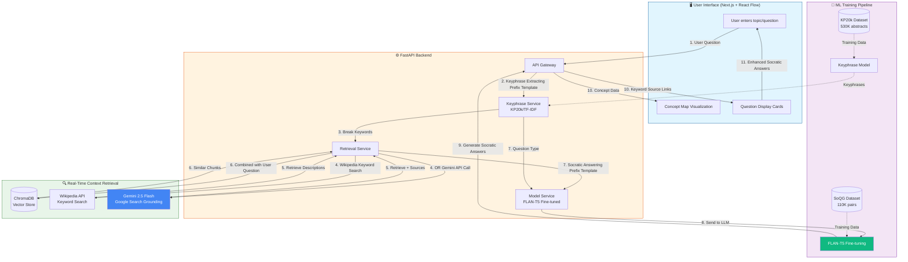

# SocraticPath MVP Project Roadmap

## Final Year Development Project - Comprehensive Guide

---

## 🎯 Marking Criteria Alignment

This roadmap is structured to help you achieve **70-100** marks in each assessment category:

| Criterion                     | Weight | Target Grade | Key Focus Areas                                                                  |
| ----------------------------- | ------ | ------------ | -------------------------------------------------------------------------------- |
| **Achievement of Objectives** | 25%    | 70-100       | All objectives achieved, functionality exceeds expectations, innovative features |
| **Use of Literature**         | 15%    | 70-100       | EACL 2023 paper, Paul & Elder taxonomy, RAG research, React Flow documentation   |
| **Methodology**               | 20%    | 70-100       | Well-defined ML pipeline, clear justification, understanding of limitations      |
| **Analysis & Implementation** | 30%    | 70-100       | Critical thinking, deep understanding, innovative solutions, well-implemented    |
| **Report Structure**          | 10%    | 70-100       | Exceptional structure, clear and professional academic writing                   |

---

## 1. One-Line Summary

**SocraticPath is an AI-powered learning companion that generates Socratic questions from user-provided context, retrieves real-time supporting information via Wikipedia/Gemini APIs, and visualizes concept relationships interactively using React Flow to foster critical thinking in students.**

---

## 2. Assumptions and Required Clarifications

- **Assumption 1:** You have a Google Cloud account for Gemini API access (free tier: 15 requests/min).
- **Assumption 2:** You have GPU access for training (Google Colab Pro $10/month, Kaggle Free 30hr/week, or university cluster with T4/A10G 16GB VRAM).
- **Assumption 3:** KP20k dataset will train keyphrase extraction; SOQG dataset will train question generation.
- **Assumption 4:** Final deployment targets a VPS or local machine with 8GB+ RAM for CPU inference.
- **Assumption 5:** SOQG dataset is publicly available at <https://github.com/NUS-IDS/eacl23_soqg>.
- **Assumption 6:** Project timeline is 8 weeks for MVP; marking criteria from Cardiff Met WRT1 rubric applies.

---

## 3. Preflight Checklist

### Data Requirements

| Item                                 | Source                                        | Status     |
| ------------------------------------ | --------------------------------------------- | ---------- |
| SoQG Dataset (~110K pairs)           | <https://github.com/NUS-IDS/eacl23_soqg>      | ☐ Download |
| KP20k Dataset (keyphrase extraction) | <https://huggingface.co/datasets/midas/kp20k> | ☐ Download |
| MTurk Annotations (for evaluation)   | SOQG repo `/data/mturk_annotations`           | ☐ Download |

### Compute Requirements

| Resource         | Specification     | Cost Alternative                            |
| ---------------- | ----------------- | ------------------------------------------- |
| Training GPU     | T4/A10G 16GB VRAM | Google Colab Pro ($10/month) or Kaggle Free |
| Inference Server | 8GB+ RAM CPU      | Railway/Render free tier or local machine   |
| Vector Store     | 2GB disk space    | Local ChromaDB (free)                       |

### Accounts and API Keys

| Service          | Purpose                    | Tier                        |
| ---------------- | -------------------------- | --------------------------- |
| Google AI Studio | Gemini API for retrieval   | Free tier (15 requests/min) |
| Hugging Face     | Model hosting and datasets | Free                        |
| Vercel           | Frontend deployment        | Free tier                   |
| GitHub           | Version control            | Free                        |

### Required Tools

- Python 3.10+
- Node.js 18+
- Git
- VS Code or similar editor
- Jupyter Notebook or JupyterLab

### Licenses to Verify

- SoQG Dataset: Academic use (cite EACL 2023 paper)
- KP20k: MIT License
- FLAN-T5: Apache 2.0
- React Flow: MIT License

---

## 3.5 Literature Review Requirements (15% of Mark)

**Essential Papers to Cite:**

| Paper                                                                 | Authors             | Year      | Relevance                      |
| --------------------------------------------------------------------- | ------------------- | --------- | ------------------------------ |
| Socratic Question Generation: A Novel Dataset, Models, and Evaluation | Ang, Gollapalli, Ng | EACL 2023 | Primary methodology source     |
| The Thinker's Guide to Socratic Questioning                           | Paul & Elder        | 2019      | Question type taxonomy         |
| Exploring the Limits of Transfer Learning with T5                     | Raffel et al.       | 2020      | Model architecture             |
| FLAN: Finetuning Language Models are Zero-Shot Learners               | Wei et al.          | 2022      | Instruction tuning methodology |
| RAG: Retrieval-Augmented Generation                                   | Lewis et al.        | 2020      | Retrieval architecture         |
| Sentence-BERT                                                         | Reimers & Gurevych  | 2019      | Embedding methodology          |
| KP20k Dataset                                                         | Meng et al.         | 2017      | Keyphrase extraction training  |

**How to Use Literature for High Marks:**

- Reference EACL 2023 paper metrics (BLEU-1: 0.172, ROUGE-L: 0.211) as your baseline targets.
- Cite Paul & Elder for the 5 Socratic question types taxonomy.
- Explain why FLAN-T5 is chosen over T5 (instruction-following capability).
- Justify ChromaDB/vector store choice with RAG literature.
- Document your methodology differences from the original paper.

---

## 3.6 Methodology Framework (20% of Mark)

**Your methodology must clearly document:**

1. **Data Pipeline Methodology**

   - Source: SoQG dataset (110K pairs) + KP20k (530K abstracts)
   - Preprocessing: Deduplication, length filtering, tokenization
   - Split: 80/10/10 (train/val/test) with fixed seed

2. **Model Training Methodology**

   - Base model: google/flan-t5-base (250M parameters)
   - Fine-tuning approach: Instruction-style prompts with question type prefixes
   - Hyperparameters: LR=5e-5, batch=4×4, epochs=3-5, fp16=True

3. **Retrieval Methodology**

   - Local: ChromaDB with sentence-transformers embeddings
   - External: Gemini API with Google Search grounding or Wikipedia API
   - Hybrid: Combine local context with web-retrieved information

4. **Evaluation Methodology**
   - Automated: BLEU-1, ROUGE-L, BERTScore
   - Manual: Fluency (5-point), Relevance (5-point), Answerability (binary)
   - Sample size: Minimum 50 questions across all 5 types

---

## 4. Step-by-Step A-to-Z Guide

### Phase 1: Project Setup (Days 1-2)

**Step 1.** Create the root project folder. Name it `socraticpath`.

**Step 2.** Inside `socraticpath`, create the following directory structure:

```
socraticpath/
├── backend/               # FastAPI server
│   ├── app/
│   │   ├── __init__.py
│   │   ├── main.py       # FastAPI entry point
│   │   ├── routes/       # API endpoints
│   │   ├── services/     # Business logic
│   │   ├── models/       # Pydantic models
│   │   └── utils/        # Helper functions
│   ├── model_artifacts/  # Trained model files
│   ├── vector_store/     # ChromaDB storage
│   └── requirements.txt
├── frontend/             # Next.js app
│   ├── src/
│   │   ├── app/
│   │   ├── components/
│   │   └── lib/
│   └── package.json
├── notebooks/            # Jupyter notebooks
│   ├── 01_data_inspection.ipynb
│   ├── 02_preprocessing.ipynb
│   ├── 03_training.ipynb
│   ├── 04_evaluation.ipynb
│   └── 05_keyphrase_extraction.ipynb
├── datasets/             # Raw and processed data
│   ├── raw/
│   │   ├── soqg/
│   │   └── kp20k/
│   └── processed/
├── scripts/              # Utility scripts
└── docs/                 # Documentation
```

**Step 3.** Initialize Git in the root folder. Create a `.gitignore` file. Add `model_artifacts/`, `datasets/raw/`, `vector_store/`, `__pycache__/`, `node_modules/`, and `.env` to it.

### Phase 2: Python Environment Setup (Day 2)

**Step 4.** Open terminal in the `socraticpath` folder. Create a Python virtual environment by running: `python -m venv venv`

**Step 5.** Activate the virtual environment. On Windows use `venv\Scripts\activate`. On Mac/Linux use `source venv/bin/activate`. You will see `(venv)` appear in your terminal.

**Step 6.** Create `requirements.txt` in the root folder with these packages:

```
# Core ML
transformers==4.40.0
accelerate==0.29.0
datasets==2.18.0
torch>=2.0.0
sentencepiece==0.2.0

# Data Processing
pandas==2.2.0
numpy==1.26.0
scikit-learn==1.4.0

# Vector Store
chromadb==0.4.24
sentence-transformers==2.6.0
faiss-cpu==1.8.0

# Backend
fastapi==0.110.0
uvicorn==0.29.0
python-dotenv==1.0.1
pydantic==2.6.0
httpx==0.27.0

# Gemini API
google-generativeai==0.5.0

# Notebooks
jupyter==1.0.0
ipywidgets==8.1.0
matplotlib==3.8.0
seaborn==0.13.0

# Evaluation
rouge-score==0.1.2
bert-score==0.3.13
nltk==3.8.1

# Utilities
tqdm==4.66.0
tabulate==0.9.0
```

**Step 7.** Install all packages by running: `pip install -r requirements.txt`

**Step 8.** Verify installation by running: `python -c "from transformers import T5ForConditionalGeneration; print('Success')"` You should see "Success" printed.

### Phase 3: Frontend Setup (Day 2)

**Step 9.** Navigate to the `frontend` folder in terminal. Run `npx create-next-app@latest . --typescript --tailwind --eslint --app --src-dir`

**Step 10.** Install additional frontend packages:

```
npm install @xyflow/react zustand axios react-markdown
npm install -D @types/node
```

**Step 11.** Create a `.env.local` file in frontend folder. Add: `NEXT_PUBLIC_API_URL=http://localhost:8000`

### Phase 4: Data Download and Inspection (Days 3-4)

**Step 12.** Clone the SOQG repository into `datasets/raw/soqg/`:

```
cd datasets/raw
git clone https://github.com/NUS-IDS/eacl23_soqg.git soqg
```

**Step 13.** Download KP20k from Hugging Face. In your notebook, this will be done programmatically using the `datasets` library.

**Step 14.** Open Jupyter by running `jupyter notebook` in terminal from the root folder. Navigate to the `notebooks` folder.

**Step 15.** Open `01_data_inspection.ipynb`. In the first cell, import pandas and load the SOQG training data:

```python
import pandas as pd

# Load SOQG chunks
train_I = pd.read_csv('../datasets/raw/soqg/data/soqg_dataset/train_chunk_I.csv', index_col=0)
train_II = pd.read_csv('../datasets/raw/soqg/data/soqg_dataset/train_chunk_II.csv', index_col=0)
train_III = pd.read_csv('../datasets/raw/soqg/data/soqg_dataset/train_chunk_III.csv', index_col=0)
train_df = pd.concat([train_I, train_II, train_III], axis=0)
train_df.reset_index(drop=True, inplace=True)
```

**Step 16.** Inspect the columns. Run `train_df.columns` and `train_df.head()`. You will see columns: `input` (context with label prefix) and `target` (question). The input format is: `{question_type}: {context_text}`.

**Step 17.** Check the five Socratic question types in the dataset:

- `clarification` - probes ambiguity
- `assumptions` - probes underlying assumptions
- `reasons_evidence` - probes justifications
- `implication_consequences` - probes impacts
- `alternate_viewpoints_perspectives` - probes other viewpoints

**Step 18.** Load KP20k in a new cell:

```python
from datasets import load_dataset
kp20k = load_dataset("midas/kp20k", trust_remote_code=True)
print(kp20k['train'].features)
```

**Step 19.** Inspect KP20k columns. You will see: `id`, `document`, `extractive_keyphrases`, `abstractive_keyphrases`. This dataset will train keyphrase extraction for context retrieval.

### Phase 5: Data Preprocessing (Days 5-6)

**Step 20.** Open `02_preprocessing.ipynb`. Create functions to clean the SOQG data:

- Remove duplicates based on `input` column
- Remove entries with empty or very short contexts (less than 20 words)
- Remove entries with very short questions (less than 5 words)
- Normalize whitespace

**Step 21.** Create the instruction format for FLAN-T5. The input format should be:

```
{task_prefix}: {question_type}: {context}
```

Example: `Generate a Socratic question: clarification: The earth is flat because...`

The target remains the question: `What evidence supports your claim?`

**Step 22.** Split the data. Use 80% train, 10% validation, 10% test. Use `sklearn.model_selection.train_test_split` with `random_state=42` for reproducibility.

**Step 23.** Tokenize the data. Use the FLAN-T5 tokenizer. Set `max_source_length=512` and `max_target_length=128`. Save tokenized data to disk:

```python
tokenized_train.save_to_disk('../datasets/processed/soqg_train')
tokenized_val.save_to_disk('../datasets/processed/soqg_val')
tokenized_test.save_to_disk('../datasets/processed/soqg_test')
```

**Step 24.** For KP20k preprocessing, create a separate instruction format:

```
Extract keyphrases from: {document}
```

Target: `keyphrase1, keyphrase2, keyphrase3`

**Step 25.** Save the processed KP20k data similarly to a separate folder.

### Phase 6: Model Training Setup (Days 7-10)

**Step 26.** Open `03_training.ipynb`. This notebook will be run on Google Colab or similar GPU environment.

**Step 27.** Choose the FLAN-T5 model size based on your hardware:

| Model         | Parameters | VRAM Required | Training Time (110K samples) |
| ------------- | ---------- | ------------- | ---------------------------- |
| flan-t5-small | 80M        | 4GB           | ~2 hours                     |
| flan-t5-base  | 250M       | 8GB           | ~6 hours                     |
| flan-t5-large | 780M       | 16GB          | ~12 hours                    |

Recommendation: Start with `flan-t5-base` for best balance.

**Step 28.** Load the model and tokenizer:

```python
from transformers import AutoModelForSeq2SeqLM, AutoTokenizer

model_id = "google/flan-t5-base"
tokenizer = AutoTokenizer.from_pretrained(model_id)
model = AutoModelForSeq2SeqLM.from_pretrained(model_id)
```

**Step 29.** Add a special token for question generation. Run:

```python
tokenizer.add_tokens(["[Question]"])
model.resize_token_embeddings(len(tokenizer))
```

**Step 30.** Load preprocessed data from disk:

```python
from datasets import load_from_disk
train_dataset = load_from_disk('../datasets/processed/soqg_train')
val_dataset = load_from_disk('../datasets/processed/soqg_val')
```

**Step 31.** Set training hyperparameters:

| Hyperparameter        | Recommended Value | Notes                           |
| --------------------- | ----------------- | ------------------------------- |
| learning_rate         | 3e-5 to 5e-5      | Start with 5e-5                 |
| batch_size            | 4-8               | Depends on VRAM                 |
| gradient_accumulation | 4-8               | Effective batch = batch × accum |
| epochs                | 3-5               | Use early stopping              |
| warmup_ratio          | 0.1               | 10% of total steps              |
| weight_decay          | 0.01              | Standard regularization         |
| fp16                  | True              | Saves memory, speeds training   |

**Step 32.** Configure the Trainer:

```python
from transformers import Seq2SeqTrainingArguments, Seq2SeqTrainer

training_args = Seq2SeqTrainingArguments(
    output_dir="./results",
    evaluation_strategy="steps",
    eval_steps=500,
    save_strategy="steps",
    save_steps=500,
    learning_rate=5e-5,
    per_device_train_batch_size=4,
    per_device_eval_batch_size=4,
    gradient_accumulation_steps=4,
    num_train_epochs=3,
    warmup_ratio=0.1,
    weight_decay=0.01,
    fp16=True,
    load_best_model_at_end=True,
    metric_for_best_model="eval_loss",
    greater_is_better=False,
    logging_steps=100,
    report_to="tensorboard",
)
```

**Step 33.** Create a data collator for seq2seq:

```python
from transformers import DataCollatorForSeq2Seq
data_collator = DataCollatorForSeq2Seq(tokenizer, model=model)
```

**Step 34.** Initialize the Trainer and start training:

```python
trainer = Seq2SeqTrainer(
    model=model,
    args=training_args,
    train_dataset=train_dataset,
    eval_dataset=val_dataset,
    data_collator=data_collator,
    tokenizer=tokenizer,
)
trainer.train()
```

**Step 35.** Save the trained model:

```python
trainer.save_model("../backend/model_artifacts/soqg_flan_t5")
tokenizer.save_pretrained("../backend/model_artifacts/soqg_flan_t5")
```

### Phase 7: Vector Store Setup (Days 11-12)

**Step 36.** Create a new notebook `05_vector_store_setup.ipynb`. This sets up the retrieval system.

**Step 37.** Choose embedding model. Recommended: `all-MiniLM-L6-v2` (fast, 384 dimensions) or `all-mpnet-base-v2` (better quality, 768 dimensions).

**Step 38.** Initialize ChromaDB:

```python
import chromadb
from chromadb.utils import embedding_functions

ef = embedding_functions.SentenceTransformerEmbeddingFunction(
    model_name="all-MiniLM-L6-v2"
)
client = chromadb.PersistentClient(path="../backend/vector_store")
collection = client.get_or_create_collection(
    name="socratic_contexts",
    embedding_function=ef
)
```

**Step 39.** Chunk and embed the training contexts. Use chunk size of 500 characters with 100 character overlap. This creates the local knowledge base.

**Step 40.** Add chunks to ChromaDB:

```python
collection.add(
    documents=chunks,
    ids=[f"chunk_{i}" for i in range(len(chunks))],
    metadatas=[{"question_type": type_, "source": "soqg"} for type_ in types]
)
```

### Phase 8: Evaluation (Days 13-14)

**Step 41.** Open `04_evaluation.ipynb`. Load the test dataset and generate predictions.

**Step 42.** Implement evaluation metrics:

- **BLEU-1, BLEU-4**: N-gram overlap (use `nltk.translate.bleu_score`)
- **ROUGE-L**: Longest common subsequence (use `rouge_score`)
- **BERTScore**: Semantic similarity (use `bert_score`)
- **BLEURT**: Learned metric (optional, requires separate install)

**Step 43.** Generate questions on test set:

```python
model.eval()
predictions = []
for batch in test_dataloader:
    outputs = model.generate(
        input_ids=batch["input_ids"],
        attention_mask=batch["attention_mask"],
        max_length=128,
        num_beams=4,
        early_stopping=True
    )
    predictions.extend(tokenizer.batch_decode(outputs, skip_special_tokens=True))
```

**Step 44.** Calculate and record metrics. Target performance (based on paper):

| Metric    | Target | Paper Reference |
| --------- | ------ | --------------- |
| BLEU-1    | >0.15  | T5-p: 0.172     |
| ROUGE-L   | >0.18  | T5-p: 0.211     |
| BERTScore | >0.60  | T5-p: 0.632     |

**Step 45.** Conduct manual evaluation. Sample 50 generated questions. Rate them for:

- Fluency (1-5): Is the question grammatically correct?
- Relevance (1-5): Is the question related to the context?
- Answerability (0/1): Can the question be answered from the context? (Should be 0 for Socratic questions)

### Phase 9: Backend Development (Days 15-18)

**Step 46.** Navigate to `backend/app/`. Create `main.py` with FastAPI initialization:

```python
from fastapi import FastAPI
from fastapi.middleware.cors import CORSMiddleware

app = FastAPI(title="SocraticPath API")
app.add_middleware(
    CORSMiddleware,
    allow_origins=["http://localhost:3000"],
    allow_credentials=True,
    allow_methods=["*"],
    allow_headers=["*"],
)
```

**Step 47.** Create `services/model_service.py`. This loads the trained model at startup:

```python
class ModelService:
    def __init__(self):
        self.model = None
        self.tokenizer = None

    def load_model(self, model_path: str):
        self.tokenizer = AutoTokenizer.from_pretrained(model_path)
        self.model = AutoModelForSeq2SeqLM.from_pretrained(model_path)
        self.model.eval()
```

**Step 48.** Create `services/retrieval_service.py`. This handles vector search and Gemini calls:

```python
class RetrievalService:
    def __init__(self):
        self.chroma_client = chromadb.PersistentClient(path="../vector_store")
        self.collection = self.chroma_client.get_collection("socratic_contexts")

    def search_local(self, query: str, n_results: int = 5):
        results = self.collection.query(query_texts=[query], n_results=n_results)
        return results["documents"][0]
```

**Step 49.** Create `services/gemini_service.py` for real-time retrieval:

```python
import google.generativeai as genai

class GeminiService:
    def __init__(self, api_key: str):
        genai.configure(api_key=api_key)
        self.model = genai.GenerativeModel('gemini-2.5-flash')

    def search_with_grounding(self, query: str):
        response = self.model.generate_content(
            contents=query,
            tools='google_search_retrieval'
        )
        return response.text, response.grounding_metadata
```

**Step 50.** Create API routes in `routes/generate.py`:

- `POST /api/generate` - Generate Socratic questions
- `POST /api/search` - Search local knowledge base
- `POST /api/retrieve` - Retrieve context from Gemini
- `GET /api/concepts` - Get concept map data

**Step 51.** Create Pydantic models in `models/schemas.py`:

```python
from pydantic import BaseModel
from typing import List, Optional

class GenerateRequest(BaseModel):
    context: str
    question_types: List[str] = ["clarification", "reasons_evidence"]

class GenerateResponse(BaseModel):
    questions: List[dict]
    keyphrases: List[str]
    sources: List[dict]
```

**Step 52.** Wire everything in `main.py`. Load model on startup:

```python
@app.on_event("startup")
async def load_models():
    model_service.load_model("./model_artifacts/soqg_flan_t5")
```

**Step 53.** Run the backend: `uvicorn app.main:app --reload --port 8000`

### Phase 10: Frontend Development (Days 19-24)

**Step 54.** Create the main page layout in `frontend/src/app/page.tsx`. Include:

- Input area for context/topic
- Question type selector
- Generated questions display
- Concept visualization panel

**Step 55.** Create API client in `frontend/src/lib/api.ts`:

```typescript
const API_URL = process.env.NEXT_PUBLIC_API_URL;

export async function generateQuestions(context: string, types: string[]) {
 const response = await fetch(`${API_URL}/api/generate`, {
  method: "POST",
  headers: { "Content-Type": "application/json" },
  body: JSON.stringify({ context, question_types: types }),
 });
 return response.json();
}
```

**Step 56.** Install React Flow for concept visualization. This is the recommended approach for concept maps:

```
npm install @xyflow/react
```

**Step 57.** Create `components/ConceptMap.tsx`. This is the key interactive feature. Use React Flow to display:

- Central node: User's topic/concept
- Connected nodes: Extracted keyphrases
- Edge labels: Relationship types
- Click handlers: Generate questions for specific concepts

**Step 58.** Implement the concept map with these features:

- **Nodes**: Each keyphrase becomes a node. Color-code by question type relevance.
- **Edges**: Connect related concepts. Use animated edges for emphasis.
- **Interactivity**: Click a node to generate Socratic questions for that concept.
- **Minimap**: Show bird's-eye view for complex maps.
- **Export**: Allow PNG download of the concept map.

**Step 59.** Create `components/QuestionCard.tsx` to display generated questions:

- Question text
- Question type badge (color-coded)
- Source attribution (if from Gemini grounding)
- Copy button

**Step 60.** Create `components/InputPanel.tsx`:

- Textarea for context input
- Topic search field (triggers Gemini retrieval)
- Question type checkboxes
- Generate button

**Step 61.** Implement the data flow:

1. User enters topic → Gemini retrieves context
2. Context displayed → User reviews/edits
3. User clicks generate → Backend processes
4. Questions returned → Display in cards
5. Keyphrases extracted → Update concept map

**Step 62.** Add loading states and error handling. Use toast notifications for errors.

**Step 63.** Style the application with Tailwind CSS. Use a clean, educational theme.

### Phase 11: Integration and Testing (Days 25-28)

**Step 64.** Create end-to-end tests. Test the full flow:

- User enters "climate change" topic
- System retrieves context from Gemini
- System generates 5 Socratic questions (one per type)
- Concept map displays related keyphrases
- User clicks keyphrase → new questions generated

**Step 65.** Test edge cases:

- Empty input
- Very long input (>2000 words)
- Non-English input
- Offensive content (should be filtered)

**Step 66.** Performance optimization:

- Add response caching for repeated queries
- Implement request debouncing on frontend
- Use streaming for long responses

**Step 67.** Create loading states for:

- Model inference (~2-5 seconds)
- Gemini retrieval (~1-3 seconds)
- Concept map generation (~500ms)

### Phase 12: Documentation and Deployment (Days 29-32)

**Step 68.** Write README.md with:

- Project overview
- Installation instructions
- Usage guide
- API documentation
- Architecture diagram

**Step 69.** Create a demo video (2-3 minutes):

- Show topic entry
- Show question generation
- Show concept map interaction
- Show source attribution

**Step 70.** Deploy backend to Railway or Render:

- Upload model artifacts
- Set environment variables
- Configure startup command

**Step 71.** Deploy frontend to Vercel:

- Connect GitHub repository
- Set `NEXT_PUBLIC_API_URL` to deployed backend URL
- Deploy

---

## 5. Concept Visualization Implementation (Key Feature)

### Why React Flow?

React Flow is the best choice for concept visualization because:

1. **Educational Focus**: Built-in support for mind maps and concept maps
2. **Ease of Use**: Simple API, works naturally with React
3. **Interactive**: Drag, zoom, pan, click handlers built-in
4. **Customizable**: Custom node and edge types
5. **Performance**: Handles hundreds of nodes smoothly
6. **Community**: Active development, good documentation

### Implementation Strategy

**Data Structure for Concepts:**

```typescript
interface ConceptNode {
 id: string;
 type: "concept" | "keyphrase" | "question";
 data: {
  label: string;
  questionType?: string;
  relevanceScore?: number;
  sourceUrl?: string; // Wikipedia/Gemini source
 };
 position: { x: number; y: number };
}

interface ConceptEdge {
 id: string;
 source: string;
 target: string;
 label?: string;
 animated?: boolean;
}
```

**Layout Algorithm:**
Use a radial layout with the main topic at center:

1. Main topic → center node
2. Primary keyphrases → first ring (distance: 150px)
3. Secondary concepts → second ring (distance: 300px)
4. Generated questions → attached to their relevant concept

**Color Coding by Question Type:**

| Question Type    | Color  | Hex Code |
| ---------------- | ------ | -------- |
| Clarification    | Blue   | #3B82F6  |
| Assumptions      | Purple | #8B5CF6  |
| Reasons/Evidence | Green  | #10B981  |
| Implications     | Orange | #F59E0B  |
| Alternatives     | Pink   | #EC4899  |

**User Interactions:**

1. **Click node** → Show related questions in sidebar
2. **Double-click node** → Generate new questions for that concept
3. **Right-click node** → Context menu (delete, expand, collapse)
4. **Drag edge** → Create manual connections between concepts
5. **Hover** → Show tooltip with definition/context

### Step-by-Step Concept Map Flow

```
User enters: "Climate change effects on agriculture"
           ↓
Backend extracts keyphrases: ["climate change", "agriculture", "crops", "weather"]
           ↓
Backend generates questions for each type:
  - Clarification: "What specific aspects of agriculture are you referring to?"
  - Assumptions: "Why do you assume climate change negatively affects all crops?"
  - Evidence: "What data supports the link between temperature and crop yields?"
  - Implications: "If farming practices don't adapt, what are the consequences?"
  - Alternatives: "Could vertical farming or GMOs mitigate these effects?"
           ↓
Frontend builds concept map:
  - Central node: "Climate Change & Agriculture" (main topic)
  - First ring: ["climate change", "agriculture", "crops", "weather"] (keyphrases)
  - Edges: Connect related concepts
  - Question badges: Color-coded by type on each relevant node
           ↓
User clicks on "crops" node:
  - Sidebar shows: All questions related to crops
  - Source links: Wikipedia/Gemini retrieved information
  - Option: "Generate more questions about this"
```

### React Flow Component Structure

```
ConceptMapPage/
├── ConceptMap.tsx           # Main React Flow canvas
├── nodes/
│   ├── TopicNode.tsx        # Central topic (large, prominent)
│   ├── KeyphraseNode.tsx    # Extracted concepts (medium)
│   └── QuestionNode.tsx     # Generated questions (small badges)
├── edges/
│   └── ConceptEdge.tsx      # Animated connections
├── panels/
│   ├── ControlPanel.tsx     # Zoom, fit, export controls
│   └── QuestionSidebar.tsx  # Shows questions for selected node
└── hooks/
    ├── useConceptMap.ts     # State management (Zustand)
    └── useLayoutEngine.ts   # Radial layout calculations
```

### Backend API Response for Concept Map

```json
{
 "topic": "Climate change effects on agriculture",
 "keyphrases": [
  { "text": "climate change", "score": 0.95 },
  { "text": "agriculture", "score": 0.92 },
  { "text": "crops", "score": 0.87 }
 ],
 "questions": [
  {
   "id": "q1",
   "type": "clarification",
   "text": "What specific agricultural regions are you referring to?",
   "relatedKeyphrases": ["agriculture"]
  },
  {
   "id": "q2",
   "type": "reasons_evidence",
   "text": "What scientific evidence links climate change to crop yield decline?",
   "relatedKeyphrases": ["climate change", "crops"],
   "source": "https://en.wikipedia.org/wiki/Climate_change_and_agriculture"
  }
 ],
 "edges": [
  {
   "source": "climate change",
   "target": "agriculture",
   "relation": "affects"
  },
  { "source": "agriculture", "ta rget": "crops", "relation": "includes" }
    ]
}
```

## 6. Minimal Hardware Guidance

### Training Phase

| Model Size    | Minimum GPU | Recommended GPU | Cloud Option            |
| ------------- | ----------- | --------------- | ----------------------- |
| flan-t5-small | 4GB VRAM    | T4 16GB         | Colab Free              |
| flan-t5-base  | 8GB VRAM    | T4 16GB         | Colab Pro ($10/mo)      |
| flan-t5-large | 16GB VRAM   | A10G 24GB       | Kaggle Free (30hr/week) |

### Inference Phase

| Setup                   | RAM    | GPU  | Cost      |
| ----------------------- | ------ | ---- | --------- |
| Local CPU               | 8GB    | None | $0        |
| Cloud CPU (Railway)     | 512MB+ | None | Free tier |
| Cloud GPU (Lambda Labs) | 16GB   | A10  | $0.60/hr  |

### Cost-Aware Alternatives

- **Training**: Use Google Colab Pro ($10/month) or Kaggle (free, 30hr/week GPU)
- **Inference**: CPU inference is acceptable for demos (2-5 second latency)
- **Vector Store**: ChromaDB local is free; Pinecone charges for hosted
- **Gemini API**: Free tier (15 requests/minute) sufficient for demos

---

## 7. Risk and Failure Modes

| Risk                 | Description                            | Mitigation                                    |
| -------------------- | -------------------------------------- | --------------------------------------------- |
| **Data Leakage**     | Test data appearing in training set    | Use fixed random seed, verify no overlap      |
| **Hallucination**    | Model generates nonsensical questions  | Filter outputs by length and pattern          |
| **OOM Errors**       | GPU memory exhaustion during training  | Reduce batch size, use gradient checkpointing |
| **Label Noise**      | Incorrect question type labels in SOQG | Use high-confidence predictions only (>0.8)   |
| **Infra Fragility**  | Gemini API rate limits or downtime     | Implement fallback to local retrieval         |
| **Licensing Issues** | Dataset or model usage restrictions    | Verify all licenses before submission         |

---

## 8. Final Delivery Checklist

### Technical Deliverables

- [ ] Trained FLAN-T5 model with >0.15 BLEU-1 score
- [ ] FastAPI backend with documented endpoints
- [ ] Next.js frontend with concept visualization
- [ ] ChromaDB vector store with indexed contexts
- [ ] Gemini integration for real-time retrieval

### Demo Requirements

- [ ] Generate questions from custom text input
- [ ] Retrieve and display context from web search
- [ ] Show interactive concept map with 10+ nodes
- [ ] Demonstrate all 5 question types
- [ ] Show source attribution for grounded responses

### Documentation

- [ ] Installation guide (README.md)
- [ ] API documentation (Swagger/OpenAPI)
- [ ] User guide with screenshots
- [ ] Technical architecture document
- [ ] Training logs and metrics report

### Success Metrics

| Metric              | Target                | Measurement Method             |
| ------------------- | --------------------- | ------------------------------ |
| Question Quality    | >3.5/5 fluency rating | Manual evaluation (20 samples) |
| Response Time       | <5 seconds            | End-to-end API latency         |
| Concept Map Load    | <2 seconds            | Frontend performance           |
| Retrieval Relevance | >70% relevant         | Manual evaluation              |

---

## 9. System Architecture Diagram



### Data Flow Explanation (Matching Your Proposal Diagram)

| Step   | Component         | Action                                                            |
| ------ | ----------------- | ----------------------------------------------------------------- |
| **1**  | User Interface    | User enters question/topic                                        |
| **2**  | Keyphrase Service | Combined with "keyphrase extracting prefix template", sent to LLM |
| **3**  | Keyphrase Service | Break keywords from user input                                    |
| **4**  | Retrieval Service | Wikipedia keyword search + API call search                        |
| **5**  | Wikipedia/Gemini  | Retrieve keyword descriptions                                     |
| **6**  | Retrieval Service | Combined with user question                                       |
| **7**  | Model Service     | Apply "Socratic answering prefix template"                        |
| **8**  | FLAN-T5 (LLM)     | Send to LLM for generation                                        |
| **9**  | Model Service     | Generate Socratic answers                                         |
| **10** | Response Assembly | Keyword source links for further exploration                      |
| **11** | User Interface    | Display enhanced Socratic answers                                 |

---

## 10. 8-Week Milestone Plan

### Week 1: Foundation

| Day | Task                       | Output                            |
| --- | -------------------------- | --------------------------------- |
| 1-2 | Project setup, environment | Directory structure, venv working |
| 3-4 | Data download, inspection  | Notebooks 01-02 complete          |
| 5   | Data preprocessing         | Processed datasets saved          |

**Deliverable**: Data exploration report (2 pages)

### Week 2: Preprocessing & Training Prep

| Day | Task                               | Output               |
| --- | ---------------------------------- | -------------------- |
| 1-2 | Complete preprocessing pipeline    | Tokenized datasets   |
| 3-4 | Set up training infrastructure     | Colab notebook ready |
| 5   | Initial training run (small model) | Baseline metrics     |

**Deliverable**: Preprocessing notebook, training config

### Week 3: Model Training

| Day | Task                               | Output                   |
| --- | ---------------------------------- | ------------------------ |
| 1-3 | Train flan-t5-base on full dataset | Trained model checkpoint |
| 4-5 | Hyperparameter tuning              | Best model selected      |

**Deliverable**: Trained model, training logs

### Week 4: Evaluation & Vector Store

| Day | Task                           | Output               |
| --- | ------------------------------ | -------------------- |
| 1-2 | Run evaluation metrics         | Metrics report       |
| 3-4 | Set up ChromaDB, index data    | Working vector store |
| 5   | Manual evaluation (20 samples) | Quality assessment   |

**Deliverable**: Evaluation report, vector store setup

### Week 5: Backend Development

| Day | Task                                  | Output                     |
| --- | ------------------------------------- | -------------------------- |
| 1-2 | FastAPI structure, model service      | Working /generate endpoint |
| 3-4 | Retrieval service, Gemini integration | Working /retrieve endpoint |
| 5   | API testing, documentation            | Swagger docs               |

**Deliverable**: Working API with all endpoints

### Week 6: Frontend Development

| Day | Task                           | Output                    |
| --- | ------------------------------ | ------------------------- |
| 1-2 | Next.js setup, API integration | Basic UI working          |
| 3-4 | React Flow concept map         | Interactive visualization |
| 5   | Question display, styling      | Polished UI               |

**Deliverable**: Functional frontend

### Week 7: Integration & Testing

| Day | Task                     | Output             |
| --- | ------------------------ | ------------------ |
| 1-2 | End-to-end integration   | Full flow working  |
| 3   | Bug fixes, edge cases    | Stable application |
| 4-5 | Performance optimization | <5s response time  |

**Deliverable**: Integrated, tested application

### Week 8: Documentation & Demo

| Day | Task                      | Output                 |
| --- | ------------------------- | ---------------------- |
| 1-2 | Write documentation       | README, user guide     |
| 3   | Record demo video         | 3-minute walkthrough   |
| 4   | Final testing, deployment | Live demo              |
| 5   | Presentation preparation  | Slides, talking points |

**Deliverable**: Final submission package

---

## 11. Plain-Language Glossary

| Term                                     | Simple Explanation                                                                                        |
| ---------------------------------------- | --------------------------------------------------------------------------------------------------------- |
| **FLAN-T5**                              | A text-to-text AI model from Google that follows instructions well. It turns input text into output text. |
| **Fine-tuning**                          | Teaching a pre-trained model a specific task using your own data.                                         |
| **Tokenization**                         | Breaking text into small pieces (tokens) that the model can understand.                                   |
| **Vector Store**                         | A database that stores text as numbers (vectors) for fast similarity search.                              |
| **Embeddings**                           | Converting text into a list of numbers that capture its meaning.                                          |
| **RAG (Retrieval-Augmented Generation)** | Finding relevant information first, then using it to generate better answers.                             |
| **Grounding**                            | Connecting AI responses to real sources to reduce made-up information.                                    |
| **Socratic Questioning**                 | A teaching method using questions to encourage critical thinking.                                         |
| **ChromaDB**                             | A free, local database for storing and searching text embeddings.                                         |
| **FastAPI**                              | A modern Python framework for building web APIs quickly.                                                  |
| **Next.js**                              | A React framework for building websites with server-side features.                                        |
| **React Flow**                           | A library for creating interactive node-based diagrams in React.                                          |
| **Batch Size**                           | How many examples the model processes at once during training.                                            |
| **Learning Rate**                        | How quickly the model updates its knowledge during training.                                              |
| **Epoch**                                | One complete pass through all training data.                                                              |
| **Inference**                            | Using a trained model to make predictions on new data.                                                    |
| **BLEU Score**                           | A metric measuring how similar generated text is to reference text.                                       |
| **Keyphrase Extraction**                 | Automatically finding the most important words/phrases in text.                                           |
| **API Endpoint**                         | A URL where your application receives and responds to requests.                                           |
| **Gemini API**                           | Google's AI service for text generation and web search grounding.                                         |

---

## 12. Experiment Tracking and Reproducibility

### What to Record

**Training Runs:**

- Date and time
- Model name and size
- Dataset version
- Hyperparameters (all of them)
- Random seed
- Final train/val loss
- Evaluation metrics
- Training duration
- GPU type and memory used

**Format:** Use a spreadsheet or Weights & Biases (free tier).

### Reproducibility Checklist

- [ ] Fixed random seed (42 recommended)
- [ ] Dataset version tagged in git
- [ ] requirements.txt with exact versions
- [ ] Training script committed before run
- [ ] Model checkpoint saved with config.json
- [ ] Evaluation script committed

### Logging Example

Create `experiments/run_log.md`:

```markdown
## Run 001 - 2024-01-15

- Model: google/flan-t5-base
- Dataset: soqg_v1 (88,040 train / 11,005 val / 11,005 test)
- Epochs: 3
- Batch: 4 × 4 accumulation = 16 effective
- LR: 5e-5
- Seed: 42
- GPU: T4 16GB
- Time: 5h 23m
- Final Val Loss: 1.234
- BLEU-1: 0.167
- Notes: Good convergence, no overfitting
```

---

## 13. Notebook Workflow Summary

| Notebook                        | Purpose               | Input                     | Output                          |
| ------------------------------- | --------------------- | ------------------------- | ------------------------------- |
| `01_data_inspection.ipynb`      | Explore raw data      | Raw CSV files             | Understanding of data structure |
| `02_preprocessing.ipynb`        | Clean and tokenize    | Raw data                  | `datasets/processed/*`          |
| `03_training.ipynb`             | Train model           | Processed data            | `model_artifacts/*`             |
| `04_evaluation.ipynb`           | Measure performance   | Trained model + test data | Metrics report                  |
| `05_keyphrase_extraction.ipynb` | Train keyphrase model | KP20k                     | Keyphrase model (optional)      |
| `06_vector_store_setup.ipynb`   | Build retrieval index | Training contexts         | ChromaDB collection             |

---

## 14. Backend Data Flow

```
1. Frontend sends POST to /api/generate
   Body: { context: "...", question_types: ["clarification", "reasons_evidence"] }

2. API Gateway receives request
   - Validates input with Pydantic
   - Logs request

3. Keyphrase Service extracts key concepts
   - Uses simple TF-IDF or trained KP20k model
   - Returns: ["climate", "emissions", "policy"]

4. Retrieval Service (parallel operations):
   a. Local search: Query ChromaDB with keyphrases
      - Returns: 5 most similar context chunks
   b. Web search: Query Gemini with grounding
      - Returns: Recent information + source URLs

5. Model Service generates questions
   - Constructs prompt: "Generate a Socratic question: {type}: {context}"
   - Runs inference for each question type requested
   - Returns: List of generated questions

6. Response assembled
   - Questions with types
   - Keyphrases for concept map
   - Sources for attribution

7. JSON response returned to frontend
```

---

## 15. How Gemini Retrieval Works

### Integration Points

1. **When to Call Gemini:**

   - User enters a topic (not full context)
   - User requests "more information"
   - Local retrieval returns low-confidence results

2. **API Configuration:**

```python
from google import genai
from google.genai.types import Tool, GoogleSearch

client = genai.Client(api_key=os.getenv("GEMINI_API_KEY"))

response = client.models.generate_content(
    model="gemini-2.5-flash",
    contents="Explain the causes of climate change",
    config={
        "tools": [Tool(google_search=GoogleSearch())]
    }
)

# Extract grounded content
text = response.text
sources = response.candidates[0].grounding_metadata
```

3. **Required Changes for Your Project:**

   - Add `GEMINI_API_KEY` to environment variables
   - Create fallback to local retrieval if API fails
   - Cache responses to reduce API calls
   - Parse `grounding_metadata` for source URLs

4. **Rate Limits:**
   - Free tier: 15 requests per minute
   - Add exponential backoff for rate limit errors
   - Queue requests if needed

---

## 16. Achieving Top Marks: Criterion-by-Criterion Guide

### Achievement of Objectives (25%)

**To Score 70-100:**

| Requirement              | Evidence to Include                                                                |
| ------------------------ | ---------------------------------------------------------------------------------- |
| All objectives achieved  | Working demo showing all 5 Socratic question types                                 |
| Exceeds expectations     | Additional features: Wikipedia integration, source citations, export functionality |
| Innovative functionality | Concept map visualization, real-time retrieval, interactive exploration            |
| Addresses user needs     | User testing results, clear UX improvements from literature                        |

**Demo Must Show:**

- [ ] User enters any topic and receives 5 types of Socratic questions
- [ ] Concept map renders with clickable nodes
- [ ] Questions display source attribution (Wikipedia/Gemini links)
- [ ] Response time under 5 seconds
- [ ] Works across multiple academic subjects

### Use of Literature (15%)

**To Score 70-100:**

| Requirement                      | How to Demonstrate                          |
| -------------------------------- | ------------------------------------------- |
| Extensive, critically analyzed   | Cite EACL 2023 paper 5+ times with analysis |
| Exceptional understanding        | Compare your results to paper benchmarks    |
| Insightful, independent research | Discuss improvements beyond original method |

**Required Citations:**

```
@inproceedings{ang-etal-2023-socratic,
    title = "Socratic Question Generation: A Novel Dataset, Models, and Evaluation",
    author = "Ang, Beng Heng and Gollapalli, Sujatha Das and Ng, See-Kiong",
    booktitle = "EACL 2023",
}
```

**Literature to Reference:**

1. Paul & Elder (2019) - Socratic questioning taxonomy
2. Ang et al. (2023) - SOQG dataset and methodology
3. Raffel et al. (2020) - T5 architecture
4. Wei et al. (2022) - FLAN instruction tuning
5. Lewis et al. (2020) - RAG architecture
6. Reimers & Gurevych (2019) - Sentence embeddings

### Methodology (20%)

**To Score 70-100:**

| Requirement               | Documentation Needed                                  |
| ------------------------- | ----------------------------------------------------- |
| Well-defined and relevant | Clear pipeline diagram with all steps                 |
| Clear justification       | Explain why FLAN-T5 over GPT, why ChromaDB over FAISS |
| Strong understanding      | Discuss hyperparameter choices with rationale         |
| Understands limitations   | Address hallucination, context window limits          |

**Methodology Documentation Template:**

```markdown
## Model Selection Justification

- Chose FLAN-T5-base (250M) because:
  - Instruction-following capability (vs vanilla T5)
  - Balance of quality and inference speed
  - Proven results on SOQG (paper achieves BLEU-1: 0.172)

## Training Configuration Justification

- Batch size 4 × 4 accumulation: Simulates batch 16 on limited GPU
- Learning rate 5e-5: Standard for T5 fine-tuning per Hugging Face
- 3-5 epochs: Prevents overfitting while achieving convergence

## Retrieval Architecture Justification

- ChromaDB for local: Zero cost, persistent storage, simple API
- Gemini grounding: Real-time information, source citations
- Hybrid approach: Balances speed (local) with freshness (web)
```

### Analysis, Discussion & Implementation (30%)

**To Score 70-100:**

| Requirement          | Evidence to Include                          |
| -------------------- | -------------------------------------------- |
| Exceptional analysis | Compare your metrics to paper benchmarks     |
| Critical thinking    | Discuss what worked, what didn't, and why    |
| Deep understanding   | Explain error analysis on failed generations |
| Innovative solutions | Novel features beyond paper scope            |
| Well-implemented     | Clean code, documented API, working demo     |

**Analysis Report Template:**

```markdown
## Results Comparison

| Metric    | Paper Baseline | Our Model     | Delta |
| --------- | -------------- | ------------- | ----- |
| BLEU-1    | 0.172          | [your result] | +/- X |
| ROUGE-L   | 0.211          | [your result] | +/- X |
| BERTScore | 0.632          | [your result] | +/- X |

## Error Analysis

- Question Type Confusion: X% clarification misclassified as assumptions
- Hallucination Rate: Y% of generated questions not grounded in context
- Most Challenging Type: [type] due to [reason]

## Innovations Beyond Original Paper

1. Real-time context retrieval (paper used static dataset)
2. Interactive visualization (paper had no UI)
3. Source attribution (paper had no grounding)
```

### Report Structure (10%)

**To Score 70-100:**

| Requirement           | How to Achieve                                    |
| --------------------- | ------------------------------------------------- |
| Exceptional structure | Follow standard ML paper format                   |
| Clear and concise     | Short paragraphs, bullet points where appropriate |
| Professional          | Consistent formatting, proper citations           |
| Strong communication  | Clear figures, tables with captions               |

**Recommended Report Structure:**

```
1. Abstract (150 words)
2. Introduction (1 page)
   - Problem statement
   - Objectives
   - Contributions
3. Literature Review (2 pages)
   - Socratic questioning background
   - Related work in QG
   - Gap analysis
4. Methodology (3 pages)
   - Data pipeline
   - Model architecture
   - Training procedure
   - Evaluation metrics
5. Implementation (4 pages)
   - System architecture
   - Backend implementation
   - Frontend implementation
   - Concept visualization
6. Results & Discussion (3 pages)
   - Quantitative results
   - Qualitative analysis
   - Comparison to baselines
   - Error analysis
7. Conclusion (1 page)
   - Summary of contributions
   - Limitations
   - Future work
8. References (1-2 pages)
```

---

## 17. Quick Reference: Commands Cheatsheet

```bash
# Environment Setup
python -m venv venv
source venv/bin/activate  # or venv\Scripts\activate on Windows
pip install -r requirements.txt

# Data Download
git clone https://github.com/NUS-IDS/eacl23_soqg.git datasets/raw/soqg

# Start Jupyter
jupyter notebook

# Start Backend
cd backend && uvicorn app.main:app --reload --host 0.0.0.0 --port 8000

# Start Frontend
cd frontend && npm run dev

# Training (on Colab)
!pip install transformers accelerate datasets
# See notebook 03_training.ipynb for full script

# Evaluation
!pip install rouge-score bert-score nltk
# See notebook 04_evaluation.ipynb for full script
```

---

_This roadmap was generated based on the EACL 2023 SocratiQ paper, Cardiff Met WRT1 marking criteria, the provided repository materials, and current best practices for FLAN-T5 fine-tuning and RAG systems. Last updated: December 2024._
